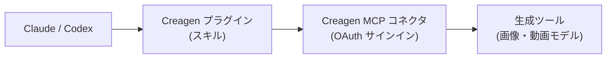

<p align="center">
  <picture>
    <source media="(prefers-color-scheme: dark)" srcset="assets/logo-dark.png">
    
  </picture>
</p>
<h1 align="center">Creagen Plugin</h1>
<h3 align="center">Creagen でつくるマーケティングクリエイティブと商品ビジュアル — Claude、Codex などの MCP 対応エージェント向け</h3>
<p align="center">
  <a href="LICENSE"></a>
  
  
  
</p>
<p align="center"><a href="README.md">English</a> · <a href="README.ko.md">한국어</a> · <b>日本語</b></p>

## できること

Creagen は、PION Corporation が提供する、商品販売者やブランドチーム向けのマーケティングクリエイティブツールです。このプラグインは Claude、Codex などの MCP 対応エージェントをお使いの Creagen アカウントに接続します。

- Creagen がホストする MCP コネクタを通じて、AI モデル(例: Google Nano Banana・Veo、OpenAI GPT Image、Kling、Seedance)で商品画像や短い動画を生成・編集します。
- EC 商品詳細ページ、ショート動画広告、UGC スタイルのレビュー動画、ファッションルックブック、単発の生成に対応する 5 つのワークフロースキルを追加します。
- 動画、一括生成、高品質ティアの前にクレジット見積もりを提示し、お客様の確認を得ます。生成にはアカウントの Creagen クレジットが消費されます。
- 含まれるのは指示文とマニフェストのみで、エージェントが読み込むスクリプト、フック、実行ファイルはありません(`.github/` フォルダーにはコントリビューター向けの CI チェックのみがあります)。スキルがエージェントに実行を促すコマンドは、アップロードウィジェットのない環境で、ユーザーが指定したファイル 1 つを Creagen が返すアップロード URL へ送る `curl -T` の 1 行のみで、そのためのスクリプトは同梱していません。スキルファイル(`SKILL.md`)はエージェントが指示として読み込むため、英語で記述しています。エージェントとはどの言語でも会話いただけます。Claude(Claude Code・Cowork を含む)は `.claude-plugin/` からスキルを読み込み、Codex は同じ `skills/<name>/SKILL.md` 形式の `skills/` ディレクトリを `.codex-plugin/plugin.json` から読み込みます。MCP サーバー URL のみを受け付けるクライアントでは、スキルなしでコネクタのみを利用できます。

ドキュメント: [creagen.vcat.ai/mcp](https://creagen.vcat.ai/mcp) · ヘルプ: [creagen.vcat.ai/help](https://creagen.vcat.ai/help) · [プライバシーポリシー](https://vcat.ai/policy/privacy-policy) · [利用規約](https://vcat.ai/policy/terms-of-service)

## クイックスタート

### Claude ディレクトリ

Claude のプラグインディレクトリで「Creagen」を検索して追加し、プラグインの Connectors タブから Creagen コネクタを接続してサインインしてください。

### Claude Code マーケットプレイス

```bash
/plugin marketplace add pioncorp/creagen-plugin
/plugin install creagen@creagen
```

続いて `/mcp` を実行し、`creagen` サーバーを認証してください。

### Codex

Codex はこのリポジトリの `.codex-plugin/plugin.json` を読み込みます。Creagen が ChatGPT・Codex のプラグインディレクトリに公開された後は、そこで「Creagen」を検索してインストールしてください。それまでは、Codex CLI からコネクタを直接接続します。

```bash
codex mcp add creagen --url https://agent.vcat.ai/api/mcp/creagenOfficialMCPServer/mcp
codex mcp login creagen
```

ブラウザでサインインを完了してから、新しい Codex の会話を開始し、`/mcp` で確認してください。

### カスタムコネクタ URL

スキルなしでコネクタのみを使う場合は、claude.ai で Settings → Connectors → Add custom connector を開き、次の URL を入力してください。

```
https://agent.vcat.ai/api/mcp/creagenOfficialMCPServer/mcp
```

## スキル

| スキル | 使う場面 | 成果物 |
|---|---|---|
| 🖼️ `creagen-generate` | 商品画像・動画 1 件: 商品カット、背景の差し替え・削除、スタイル編集、キービジュアル、短いクリップ。 | 完成した画像または動画 1 件。 |
| 🛍️ `creagen-product-detail-page` | 実際の商品写真から作る縦長の EC 商品詳細ページ。 | セクションごとの生成画像を含む幅 860px の HTML ページ。 |
| 🎬 `creagen-promo-video` | Reels・Shorts・TikTok 向けの 9:16 縦型ショート動画広告。 | 絵コンテ、低コストのリファレンスシート、完成クリップ 1 本。 |
| 🗣️ `creagen-ugc-video` | 人物が商品を紹介する UGC スタイルのレビュー動画。 | 承認済みの台本と、ナレーション付きのクリップ 1 本。 |
| 👗 `creagen-lookbook` | 衣料品の写真から作るファッション画像。 | バーチャル試着、多角度カット、選んだカットのレタッチ。 |

リクエスト例:

- 「この商品写真を、すっきりした白背景のカットと、大理石カウンターの上のライフスタイルカットにしてください。」
- 「この写真とセールスポイントから、このクリームの詳細ページを作ってください。」
- 「ランナー向けに、私のスニーカーの 15 秒縦型広告を作ってください。」

## 仕組み



エージェントはスキルに従って、Creagen コネクタ(`.mcp.json`)のツールを呼び出します。コネクタはリモート MCP サーバー `https://agent.vcat.ai/api/mcp/creagenOfficialMCPServer/mcp` です。モデルごとの生成ツールに加え、クレジット見積もりと残高、ファイルアップロード、進行状況・メディアウィジェット、保存済みの Creagen メモリーとチャットルーム、コンサルタントツール(フォトグラファー、コピーライター、脚本家、バナー・カルーセル・詳細ページ・UGC デザイナー)、結果の検証、ガイド付きジャーニーを提供します。

## 必要なもの

- Creagen アカウント。[creagen.vcat.ai](https://creagen.vcat.ai) で登録できます。
- Creagen クレジット。画像・動画の生成にはクレジットが消費されます。見積もり、残高確認、コンサルタントツール、ジャーニーでは生成クレジットは消費されません。
- 初回利用時に、コネクタの OAuth フローで Creagen にサインインしてください。

| クライアント | 進行状況・メディアウィジェット | ファイルアップロード |
|---|---|---|
| Claude(Web・デスクトップ) | 会話内に表示されます | アップロードウィジェット |
| Claude Code | 表示されません。Claude がジョブの状態をテキストで確認します | アップロードリンク経由でローカルファイルパスを送信 |
| Cowork | ホストが MCP Apps ウィジェットを表示する場合は表示、それ以外はテキストで状態を確認 | ウィジェット表示時はアップロードウィジェット、それ以外はローカルファイルパス |
| Codex デスクトップ | MCP Apps に対応。Creagen ウィジェットの表示は未検証のため、テキストでの状態確認にフォールバック | 表示されればアップロードウィジェット、それ以外はローカルファイルパス |
| Codex CLI | 表示されません(ターミナル)。Codex がジョブの状態をテキストで確認し、結果 URL を返します | アップロードリンク経由でローカルファイルパスを送信 |

## データとプライバシー

コネクタをご利用になると、エージェントは各ツールの実行に必要な情報を Creagen に送信します。具体的には、プロンプト、アップロードまたはリンクされた画像・動画、分析を依頼された URL、ツールへの入力値です。Creagen はこれらを自社サーバーで処理し、生成リクエストを上記の AI モデル提供元に渡します。生成メディア、アップロード、メモリー、スキル、プラン、ジャーニーの進行状況はお客様の Creagen アカウントに保存され、コネクタで作成した結果は Creagen ギャラリーの「MCP」フィルターに表示されます。プラグイン自体は何も保存せず、Creagen コネクタ以外にデータを送信することはありません。

- プライバシーポリシー: https://vcat.ai/policy/privacy-policy
- 利用規約: https://vcat.ai/policy/terms-of-service

## サポート

- ヘルプセンター: https://creagen.vcat.ai/help
- メール: help@vcat.ai
- セキュリティに関する問題: [SECURITY.md](SECURITY.md) をご覧ください。
- コントリビューション: [CONTRIBUTING.md](CONTRIBUTING.md) をご覧ください。

## ライセンス

このリポジトリのスキル文書とマニフェストは MIT License で公開しています([LICENSE](LICENSE) を参照)。Creagen サービスのご利用には Creagen の利用規約が適用されます。

`assets/` 内の Creagen の名称・ロゴ・アイコンは PION Corporation の商標であり、MIT License の対象外です。© PION Corporation.
