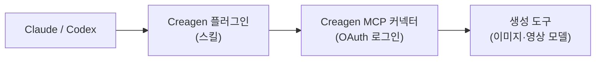

<p align="center">
  <picture>
    <source media="(prefers-color-scheme: dark)" srcset="assets/logo-dark.png">
    
  </picture>
</p>
<h1 align="center">Creagen Plugin</h1>
<h3 align="center">Creagen 으로 만드는 마케팅 크리에이티브와 상품 비주얼 — Claude, Codex 등 MCP 지원 에이전트용</h3>
<p align="center">
  <a href="LICENSE"></a>
  
  
  
</p>
<p align="center"><a href="README.md">English</a> · <b>한국어</b> · <a href="README.ja.md">日本語</a></p>

## 무엇을 하나

Creagen 은 PION Corporation 이 만든 상품 판매자·브랜드 팀용 마케팅 크리에이티브 도구입니다. 이 플러그인은 Claude, Codex 등 MCP 를 지원하는 에이전트를 Creagen 계정에 연결합니다.

- Creagen 이 호스팅하는 MCP 커넥터로 AI 모델(예: Google Nano Banana·Veo, OpenAI GPT Image, Kling, Seedance)을 써서 상품 이미지와 짧은 영상을 생성·편집합니다.
- 이커머스 상세페이지, 숏폼 상품 광고, UGC 스타일 리뷰 영상, 패션 룩북, 단건 생성용 워크플로 스킬 5종을 더합니다.
- 영상·일괄 생성·고품질 티어 전에 크레딧 견적을 보여주고 사용자 확인을 받습니다. 생성은 계정의 Creagen 크레딧이 차감됩니다.
- 지시문과 매니페스트만 들어 있고 스크립트·훅·실행 파일은 없습니다. 스킬 파일(`SKILL.md`)은 에이전트가 지시문으로 읽기 때문에 영어로 작성합니다. 에이전트와의 대화는 어떤 언어로 해도 됩니다. Claude(Claude Code·Cowork 포함)는 `.claude-plugin/` 으로 스킬을 불러오고, Codex 는 같은 `skills/<name>/SKILL.md` 형식의 `skills/` 디렉터리를 `.codex-plugin/plugin.json` 으로 불러옵니다. MCP 서버 URL 만 받는 클라이언트는 스킬 없이 커넥터만 쓰게 됩니다.

문서: [creagen.vcat.ai/mcp](https://creagen.vcat.ai/mcp) · 도움말: [creagen.vcat.ai/help](https://creagen.vcat.ai/help) · [개인정보처리방침](https://vcat.ai/policy/privacy-policy) · [이용약관](https://vcat.ai/policy/terms-of-service)

## 빠른 시작

### Claude 디렉터리

Claude 플러그인 디렉터리에서 "Creagen" 을 검색해 추가하고, 플러그인의 Connectors 탭에서 Creagen 커넥터를 연결해 로그인합니다.

### Claude Code 마켓플레이스

```bash
/plugin marketplace add pioncorp/creagen-plugin
/plugin install creagen@creagen
```

이어서 `/mcp` 로 `creagen` 서버를 인증합니다.

### Codex

Codex 는 이 레포의 `.codex-plugin/plugin.json` 을 읽습니다. Creagen 이 ChatGPT·Codex 플러그인 디렉터리에 게시되면 그곳에서 "Creagen" 을 검색해 설치합니다. 그 전에는 Codex CLI 로 커넥터를 직접 연결합니다.

```bash
codex mcp add creagen --url https://agent.vcat.ai/api/mcp/creagenOfficialMCPServer/mcp
codex mcp login creagen
```

브라우저에서 로그인을 마친 뒤 새 Codex 대화를 시작하고 `/mcp` 로 확인합니다.

### 커스텀 커넥터 URL

스킬 없이 커넥터만 쓸 때: claude.ai 에서 Settings → Connectors → Add custom connector 로 이동해 다음 주소를 입력합니다.

```
https://agent.vcat.ai/api/mcp/creagenOfficialMCPServer/mcp
```

## 스킬

| 스킬 | 언제 쓰나 | 산출물 |
|---|---|---|
| 🖼️ `creagen-generate` | 상품 이미지·영상 1건: 상품 컷, 배경 교체·제거, 스타일 편집, 키 비주얼, 짧은 클립. | 완성 이미지 또는 영상 1건. |
| 🛍️ `creagen-product-detail-page` | 실제 상품 사진으로 만드는 긴 이커머스 상세페이지. | 섹션별 생성 이미지가 들어간 860px 폭 HTML 페이지. |
| 🎬 `creagen-promo-video` | Reels·Shorts·TikTok 용 9:16 세로형 숏폼 상품 광고. | 스토리보드, 저비용 레퍼런스 시트, 최종 클립 1개. |
| 🗣️ `creagen-ugc-video` | 인물이 상품을 소개하는 UGC 스타일 리뷰 영상. | 승인된 대본과 음성 내레이션이 있는 클립 1개. |
| 👗 `creagen-lookbook` | 의류 사진으로 만드는 패션 이미지. | 가상 피팅, 다각도 컷, 선택 컷 리터칭. |

요청 예시:

- "이 상품 사진을 깔끔한 흰 배경 컷과 대리석 카운터 위 라이프스타일 컷으로 만들어줘."
- "이 사진과 셀링 포인트로 이 크림 상세페이지 만들어줘."
- "러너를 겨냥한 내 운동화 15초 세로형 광고 만들어줘."

## 동작 방식



에이전트는 스킬을 따라 Creagen 커넥터(`.mcp.json`)의 도구를 호출합니다. 커넥터는 원격 MCP 서버 `https://agent.vcat.ai/api/mcp/creagenOfficialMCPServer/mcp` 입니다. 모델별 생성 도구 외에 크레딧 견적·잔액, 파일 업로드, 진행·미디어 위젯, 저장된 Creagen 메모리·채팅방, 컨설턴트 도구(포토그래퍼, 카피라이터, 시나리오 작가, 배너·캐러셀·상세페이지·UGC 디자이너), 결과 검수, 가이드 여정을 제공합니다.

## 필요 조건

- Creagen 계정. [creagen.vcat.ai](https://creagen.vcat.ai) 에서 가입합니다.
- Creagen 크레딧. 이미지·영상 생성은 크레딧을 차감합니다. 견적, 잔액 조회, 컨설턴트 도구, 여정은 생성 크레딧을 쓰지 않습니다.
- 처음 사용할 때 커넥터의 OAuth 흐름으로 Creagen 에 로그인합니다.

| 클라이언트 | 진행·미디어 위젯 | 파일 업로드 |
|---|---|---|
| Claude (웹·데스크톱) | 대화 안에 표시 | 업로드 위젯 |
| Claude Code | 표시 안 됨. Claude 가 작업 상태를 텍스트로 확인 | 업로드 링크로 로컬 파일 경로 전송 |
| Cowork | 호스트가 MCP Apps 위젯을 렌더하면 표시, 아니면 텍스트 상태 | 위젯이 표시되면 업로드 위젯, 아니면 로컬 파일 경로 |
| Codex 데스크톱 | MCP Apps 지원. Creagen 위젯 렌더는 아직 검증 전이라 텍스트 상태로 폴백 | 렌더되면 업로드 위젯, 아니면 로컬 파일 경로 |
| Codex CLI | 표시 안 됨(터미널). Codex 가 작업 상태를 텍스트로 확인하고 결과 URL 을 전달 | 업로드 링크로 로컬 파일 경로 전송 |

## 데이터와 개인정보

커넥터를 사용하면 에이전트는 각 도구 실행에 필요한 정보를 Creagen 에 보냅니다: 프롬프트, 업로드하거나 링크한 이미지·영상, 분석을 요청한 URL, 도구 입력값. Creagen 은 이를 자체 서버에서 처리하고 생성 요청을 위에 적은 AI 모델 제공사에 전달합니다. 생성 미디어, 업로드, 메모리, 스킬, 플랜, 여정 진행 상황은 Creagen 계정에 저장되며, 커넥터로 만든 결과는 Creagen 갤러리의 "MCP" 필터에 표시됩니다. 플러그인 자체는 아무것도 저장하지 않고 Creagen 커넥터 외에는 데이터를 보내지 않습니다.

- 개인정보 처리방침: https://vcat.ai/policy/privacy-policy
- 이용약관: https://vcat.ai/policy/terms-of-service

## 지원

- 도움말 센터: https://creagen.vcat.ai/help
- 이메일: help@vcat.ai
- 보안 문제: [SECURITY.md](SECURITY.md) 참고.
- 기여: [CONTRIBUTING.md](CONTRIBUTING.md) 참고.

## 라이선스

이 레포의 스킬 문서와 매니페스트는 MIT License 로 공개됩니다([LICENSE](LICENSE) 참고). Creagen 서비스 이용은 Creagen 이용약관을 따릅니다.

`assets/` 의 Creagen 이름·로고·아이콘은 PION Corporation 의 상표이며 MIT License 대상이 아닙니다. © PION Corporation.
