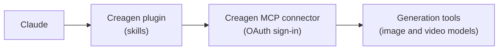

<p align="center">
  <picture>
    <source media="(prefers-color-scheme: dark)" srcset="assets/logo-dark.png">
    
  </picture>
</p>
<h1 align="center">Creagen for Claude</h1>
<h3 align="center">Marketing creative and product visuals with Creagen, from inside Claude</h3>
<p align="center">
  <a href="LICENSE"></a>
  
  
  
</p>
<p align="center"><b>English</b> · <a href="README.ko.md">한국어</a> · <a href="README.ja.md">日本語</a></p>

## What it does

Creagen is a marketing creative tool for product sellers and brand teams, made by PION Corporation. This plugin connects Claude to your Creagen account.

- Generates and edits product images and short videos with AI models (for example Google Nano Banana and Veo, OpenAI GPT Image, Kling, and Seedance) through Creagen's hosted MCP connector.
- Adds five workflow skills for e-commerce detail pages, short-form product ads, UGC-style review videos, fashion lookbooks, and single generations.
- Shows a credit estimate and asks for your go-ahead before videos, batches, and higher-quality tiers. Generations are billed in Creagen credits on your account.
- Contains instruction text and manifests only: no scripts, hooks, or executables. The skill files (`SKILL.md`) are in English because Claude reads them as instructions; you can talk to Claude in any language.

Documentation: [creagen.vcat.ai/mcp](https://creagen.vcat.ai/mcp) · Help: [creagen.vcat.ai/help](https://creagen.vcat.ai/help) · [Privacy Policy](https://vcat.ai/policy/privacy-policy) · [Terms of Service](https://vcat.ai/policy/terms-of-service)

## Quick start

### Claude Directory

Search for "Creagen" in the Claude plugin directory, add it, then connect the Creagen connector from the plugin's Connectors tab and sign in.

### Claude Code marketplace

```bash
/plugin marketplace add pioncorp/creagen-plugin
/plugin install creagen@creagen
```

Then run `/mcp` to authenticate the `creagen` server.

### Custom connector URL

Connector only, without the skills: in claude.ai, go to Settings → Connectors → Add custom connector and enter:

```
https://agent.vcat.ai/api/mcp/creagenOfficialMCPServer/mcp
```

## Skills

| Skill | When to use it | Output |
|---|---|---|
| 🖼️ `creagen-generate` | One product image or video: a product shot, background swap or removal, style edit, key visual, or short clip. | One finished image or video. |
| 🛍️ `creagen-product-detail-page` | A long-form e-commerce detail page from a real product photo. | An 860px-wide HTML page with generated section images. |
| 🎬 `creagen-promo-video` | A vertical 9:16 short-form product ad for Reels, Shorts, or TikTok. | Storyboard, low-cost reference sheet, and one finished clip. |
| 🗣️ `creagen-ugc-video` | A UGC-style review video with a person presenting the product. | Approved script and one clip with spoken narration. |
| 👗 `creagen-lookbook` | Fashion imagery from garment photos. | Virtual try-on, multi-angle shots, and retouched picks. |

Example requests:

- "Turn this product photo into a clean white-background shot and a lifestyle shot on a marble counter."
- "Make a detail page for this cream from the photo and these selling points."
- "Create a 15-second vertical ad for my sneakers aimed at runners."

## How it works



Claude follows the skills and calls the tools of the Creagen connector (`.mcp.json`), a remote MCP server at `https://agent.vcat.ai/api/mcp/creagenOfficialMCPServer/mcp`. Besides one generation tool per model, the connector provides credit estimates and balance, file upload, progress and media widgets, your saved Creagen memories and chat rooms, consultant tools (photographer, copywriter, screenwriter, and banner, carousel, detail-page, and UGC designers), result audit, and guided journeys.

## Requirements

- A Creagen account. Sign up at [creagen.vcat.ai](https://creagen.vcat.ai).
- Creagen credits. Image and video generation spend credits; estimates, balance checks, consultant tools, and journeys do not spend generation credits.
- On first use, sign in to Creagen through the connector's OAuth flow.

| Client | Progress and media widgets | File upload |
|---|---|---|
| Claude (web and desktop) | Shown in the conversation | Upload widget |
| Claude Code | Not shown; Claude checks job status as text | Local file path via an upload link |
| Cowork | Shown when the host renders MCP Apps widgets; otherwise text status | Upload widget when widgets are shown; otherwise local file path |

## Data & privacy

When you use the connector, Claude sends Creagen the information needed to run each tool: your prompts, the images or videos you upload or link, URLs you ask it to analyze, and the tool inputs. Creagen processes these on its servers and passes generation requests to the AI model providers listed above. Generated media, uploads, memories, skills, plans, and journey progress are stored in your Creagen account; results made through the connector appear in your Creagen gallery under the "MCP" filter. The plugin itself stores nothing and sends data nowhere other than the Creagen connector.

- Privacy policy: https://vcat.ai/policy/privacy-policy
- Terms of service: https://vcat.ai/policy/terms-of-service

## Support

- Help center: https://creagen.vcat.ai/help
- Email: help@vcat.ai
- Security issues: see [SECURITY.md](SECURITY.md).
- Contributing: see [CONTRIBUTING.md](CONTRIBUTING.md).

## License

The skill text and manifests in this repository are released under the MIT License (see [LICENSE](LICENSE)). Use of the Creagen service is governed by the Creagen terms of service.

The Creagen name, logo, and icon in `assets/` are trademarks of PION Corporation and are not covered by the MIT License. © PION Corporation.
